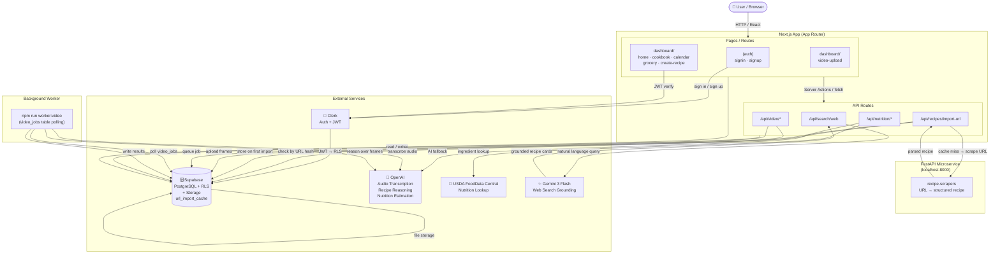

# System Architecture

```mermaid
flowchart TB
    Browser(["👤 User / Browser"])

    subgraph NextApp["Next.js App (App Router)"]
        direction TB

        subgraph Pages["Pages / Routes"]
            Auth["(auth)\nsignin · signup"]
            Dashboard["dashboard/\nhome · cookbook · calendar\ngrocery · create-recipe"]
            VideoUpload["dashboard/\nvideo-upload"]
        end

        subgraph API["API Routes"]
            WebSearchAPI["/api/search/web"]
            RecipeImport["/api/recipes/import-url"]
            VideoAPI["/api/video/*"]
            NutritionAPI["/api/nutrition/*"]
        end
    end

    subgraph Worker["Background Worker"]
        VideoWorker["npm run worker:video\n(video_jobs table polling)"]
    end

    subgraph Microservice["FastAPI Microservice\n(localhost:8000)"]
        Scraper["recipe-scrapers\nURL → structured recipe"]
    end

    subgraph ExternalServices["External Services"]
        Clerk["🔐 Clerk\nAuth + JWT"]
        Supabase[("🗄️ Supabase\nPostgreSQL + RLS\n+ Storage\nurl_import_cache")]
        OpenAI["🤖 OpenAI\nAudio Transcription\nRecipe Reasoning\nNutrition Estimation"]
        USDA["🥦 USDA FoodData Central\nNutrition Lookup"]
        Gemini["✨ Gemini 3 Flash\nWeb Search Grounding"]
    end

    Browser -->|"HTTP / React"| Pages
    Pages -->|"Server Actions / fetch"| API

    Auth -->|"sign in / sign up"| Clerk
    Dashboard -->|"JWT verify"| Clerk
    Clerk -->|"JWT → RLS"| Supabase

    WebSearchAPI -->|"natural language query"| Gemini
    Gemini -->|"grounded recipe cards"| WebSearchAPI

    RecipeImport -->|"check by URL hash"| Supabase
    RecipeImport -->|"cache miss → scrape URL"| Scraper
    Scraper -->|"parsed recipe"| RecipeImport
    RecipeImport -->|"store on first import"| Supabase

    VideoAPI -->|"upload frames"| Supabase
    VideoAPI -->|"queue job"| Supabase

    NutritionAPI -->|"ingredient lookup"| USDA
    NutritionAPI -->|"AI fallback"| OpenAI

    VideoWorker -->|"poll video_jobs"| Supabase
    VideoWorker -->|"transcribe audio"| OpenAI
    VideoWorker -->|"reason over frames"| OpenAI
    VideoWorker -->|"write results"| Supabase

    API -->|"read / write"| Supabase
    Pages -->|"read / write"| Supabase
    Supabase -->|"file storage"| Supabase
```
